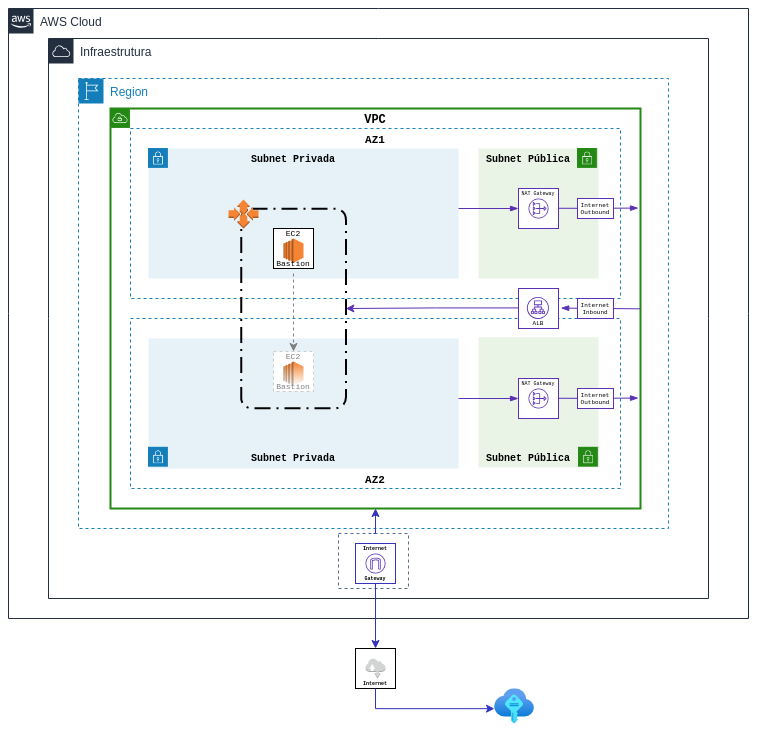

# Terraform AWS Bastion Hosts

A bastion host is a server whose purpose is to provide access to a private network from an external network, such as the Internet. The Environment was set to Multi-AZ over an Auto-Scaling to ensure that an instance number always matches the one specified in the private subnet over a Elastic Load Balance in the public subnet



***Note***
>The template will deploy Bastion Host in an existing VPC configured with public and private subnets according to AWS best practices, to provision its own virtual network on AWS.

This template has a terraform modules that provides the following resources:
- [Launch Config](https://github.com/jslopes8/terraform-aws-as-launch-config.git)
- [AutoScaling Group](https://github.com/jslopes8/terraform-aws-as-asgroup.git)
- [Elastic Load Balance](https://github.com/jslopes8/terraform-aws-lb-elb.git)
- [Security Group](https://github.com/jslopes8/terraform-aws-networking-security-group.git)

## Directory tree structure
```bash
$ tree
.
├── cloud-config.tf
├── data-sources.tf
├── load-balance.tf
├── launch-config.tf
├── sec-group.tf
├── scale-group.tf
├── img
│   └── BastionHost.png
├── pki
│   └── bastion-hub.key
│   └── bastion-hub.pub
├── startup-scripts
│   └── bootstrap
└── README.md

3 directories, 8 files
```

### Understanding the structure of the template
- `cloud-config.tf` - AWS credentials as well as setting the Terraform Backend S3.
- `data-sources.tf` - At runtime, get the id of the public and private subnets according to the definition of the VPC Id.
- `sec-group.tf` - Security Group settings with thorough inbound access control.
- `launch-config.tf` - Launch Configuration definition with instance type, user-data, AMI and others.
- `scale-group.tf` - Auto Scaling setup with a configurable number of instances.
- `load-balance.tf` - Elastic Load Balance configuration.
- `startup-scripts/bootstrap` - Configuration file on linux startup.

## Important
>A best-practice of using Terraform is not to put your access keys and secret in the configuration file. My recommendation is to use the configuration file to specify your credentials. The default location is "$HOME/.aws/credentials" on Linux and macOS or "%USERPROFILE%\.aws\credentials" on Windows. By setting the profile argument in the provider block, by default terraform will fetch this information from this configuration file with your credentials.

## Usage
Terraform Module EC2 Launch Configuration: Choose Amazon Linux 2 most receent and Instance type and others.
```bash
module "launch_config_bastion" {
  source = "git::https://github.com/jslopes8/terraform-aws-as-launch-config.git?ref=v2.1"

  # choose between launch configuration or launch template
  launch_configuration = "true"

  name            = "LC-${local.stack_name}"
  instance_type   = "t2.medium"

  security_groups = [ module.ec2_bastion_sg.id ]
  key_name        = aws_key_pair.main.key_name
  user_data       = data.template_file.user_data.rendered

  # For this example I'm looking for a newer version of Amazon Linux 2
  # another valid argument is ami_id, but conflicts with choose_ami
  choose_ami = [{
    most_recent = "true"
    owners      = [ "amazon" ]
    filter      = [
      {
        name = "owner-alias"
        values = [ "amazon" ]
      },
      {
        name = "name"
        values = ["amzn2-ami-hvm*"]
      }
    ]
  }]

  # EBS Block Device - OS Volume
  root_block_device = [{
    volume_type           = "gp2"
    volume_size           = "40"
    delete_on_termination = "true"
    encrypted             = "true"
  }]
}
```

Terraform Module EC2 AutoScaling: Auto Scaling setup with a configurable number of instances.
```bash
module "autoscaling_bastion" {
  source = "git::https://github.com/jslopes8/terraform-aws-as-asgroup.git?ref=v2.0.7"

  asg_name  = "${local.stack_name}-AS"
  min_size  = 1
  max_size  = 1

  vpc_zone_identifier     = [ 
    tolist(data.aws_subnet_ids.sn_priv.ids)[0],
    tolist(data.aws_subnet_ids.sn_priv.ids)[1], 
  ]
  health_check_type       = "ELB"
  launch_configuration    = module.launch_config_bastion.name
  load_balancers          = [ module.elb_bastion.id ]

  # Scaling Policy
  auto_scaling_policy_up = [{
    name                = "${local.stack_name}-Policy-UP"
    scaling_adjustment  = "1"
    adjustment_type     = "ChangeInCapacity"
    cooldown            = "300"
    policy_type         = "SimpleScaling"
    alarm_name          = "${local.stack_name}-Metric-Alarm-UP"
    comparison_operator = "GreaterThanOrEqualToThreshold"
    evaluation_periods  = "2"
    namespace           = "AWS/EC2"
    metric_name         = "CPUUtilization"
    period              = "300"
    statistic           = "Average"
    threshold           = "60"
  }]

  auto_scaling_policy_down = [{
    name                = "${local.stack_name}-Policy-DOWN"
    scaling_adjustment  = "-1"
    adjustment_type     = "ChangeInCapacity"
    cooldown            = "300"
    policy_type         = "SimpleScaling"
    alarm_name          = "${local.stack_name}-Metric-Alarm-DOWN"
    comparison_operator = "LessThanOrEqualToThreshold"
    evaluation_periods  = "2"
    namespace           = "AWS/EC2"
    metric_name         = "CPUUtilization"
    period              = "120"
    statistic           = "Average"
    threshold           = "5"
  }]

  default_tags = [
    {
      "key"                 = "ApplicationRole"
      "value"               = "Bastion Host"
      "propagate_at_launch" = true
    },
    {
      "key"                 = "Environment"
      "value"               = "Production"
      "propagate_at_launch" = true
    },
    {
      "key"                 = "CostCenter"
      "value"               = "12345678"
      "propagate_at_launch" = true
    }
  ]
}
```

## Requirements
| Name | Version |
| ---- | ------- |
| aws | ~> 3.1 |
| terraform | ~> 0.14 |